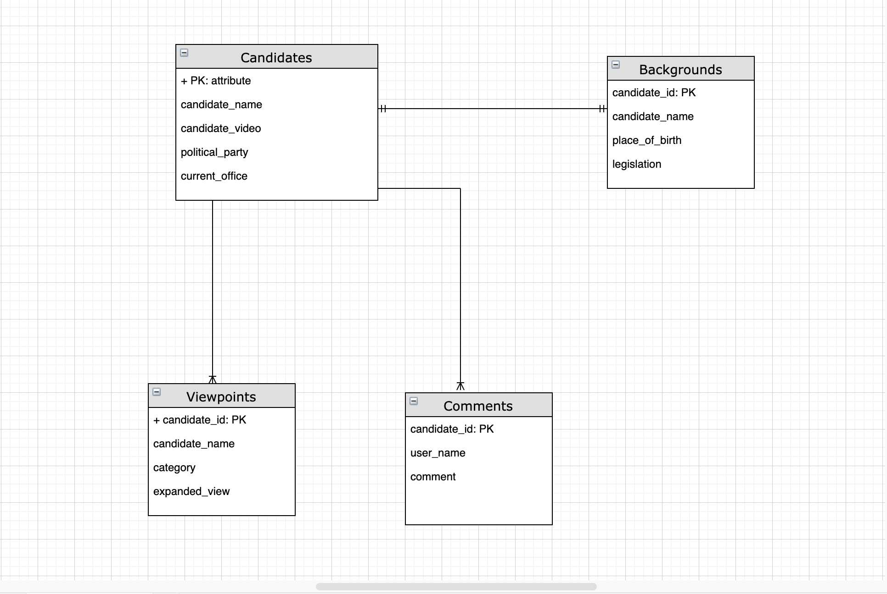
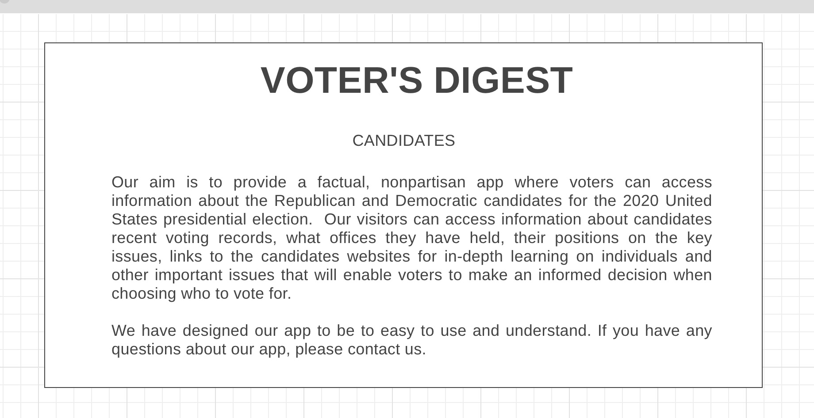
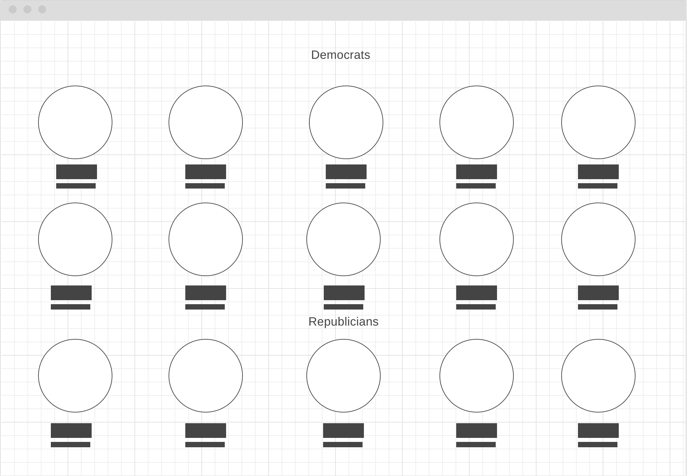
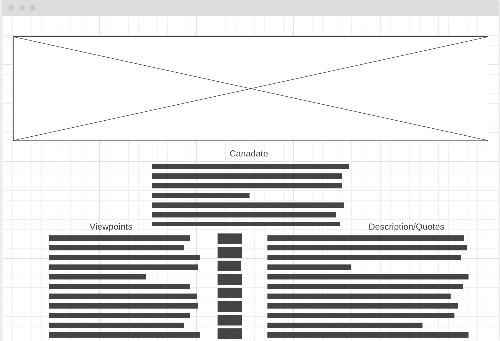

# Project 3: Voter's Digest  
## A PERN (Postgres, Express, React, Node) Stack application

## Links

Github Repo: 

## Overview

The Voter's Digest app is a comprehensive guide of the 13 leading candidates for the 2020 presidential election. The primary objective of the app is to present the major candidates, along with their positions in ten key categories, in a succinct and unbiased manner. The primary target audience is the undecided voter who wants to vote based on a candidate's position(s).  Our goal was to achieve a lightweight, rapidly loading and easy to navigate app.  Some key features of the app include each candidate's campaign ad video embedded in the app and a comment section where the user can read, create, update and delete comments for each candidate. Asubtle feature to note, in effort to keep the app as unbiased as possible, the candidates are simply arranged in alphabetical order instead of being grouped by party affiliation.    


## Technologies used:  

- __Command Line:__ Practice interacting with the computer and navigating the filesystem from the command line.
- __Source Control:__ Manage and interact with a git repository to store changes to code.
- __Programming Fundamentals:__ Work with objects, constructors, events, while learning how to strategically solve problems and resolve errors.
- __Web Fundamentals:__ Learn how communication happens over the internet, and how to structure, style, and animate documents within a browser. Also learn how to respond to actions your users take and the data they input into the browser.
- __Browser Applications:__ Dive into CSS, and figure out how to use libraries and frameworks to get lots of style and functionality for free.
- __Deployment:__ Host a web application in a managed hosting environment.
- __Responsive Web Design:__ Making web applications that respond to device size.
- __Server Side Applications:__ Server-side scripting is a technique used in web development which involves employing scripts on a web server which produce a response customized for each user's (client's) request to the website.
- __Databases:__ A structured set of data held in a computer, especially one that is accessible in various ways.
- __SQL:__ SQL is used to communicate with a database. It is the standard language for relational database management systems. SQL statements are used to perform tasks such as update data on a database, or retrieve data from a database.
- __AJAX:__ Using Axios to make asynchronous javascript calls.
- __APIs:__ Communicating to an API using Axios to fetch data.
- __Node:__ An open-source, cross-platform JavaScript run-time environment that executes JavaScript code outside of a browser.
- __NPM:__ A package manager for Node.js packages, or modules
- __PGAdmin:__ A manual user interface for PostgresSQL and derivative relational databases.
- __Postman:__ A collaborative platform for API development which helps to siplify wach step of building an API.  
- __React:__ A front end framework for building modern web applications.
- __Express:__ A minimal and flexible Node.js web application framework that provides a robust set of features for web and mobile applications.
- __JSON APIs:__ JSON (or JavaScript Object Notation) is a lightweight, easy and popular way to exchange data. A backend REST service to deliver some data in JSON format to the front-end application.

## Entity Relationship Diagram



## User Stories
1.  As a user I want to be able to get factual, unbiased information on the candidates and their positions.
2. As a user I want to be able to find information about all of the major candidates in one place.
3. As a user I want a brief summary of the candidate’s major accomplishments so I can have an idea of what they have done and how that would qualify them to be president
4. As a user I want to be able to compare the candidates positions on major issues in one place.
5. As a user I want to be able to see the candidate’s photos along with their names for easy recognition.
6. As a user, I want to be able find a brief synopsis of the important achievements in their political careers.
7. As a user I want to be able to find links to all of the candidates web sites.
8. As a user I want to be able to have a candidate’s position on major issues explained in simple terms.
9. As a user I want an app that loads quickly, is easy to use and navigate and most of all, provides its information in an easy to read and understand format.
10. As a user I want an app that is responsive so I can read it with the same ease on my desktop, laptop, tablet or phone, regardless of the screen size.


## Wireframes






## More to come...
- Integrate a 3rd-party API to display upcoming events related to the election such as primaries and debates.  
- General bug fixing and testing on front end issues, comments section has minor glitches and CSS properties could be cleaned further.
- Add authentication so that we can allow administrators of the site to add candidates.  

## Installation

### Express Backend Set-up

#### To Install

- Fork and clone `https://github.com/llpatillo/project3-backend-starter`
- `cd` into the app and `npm install`
- From the command line run `createdb project3-backend-dev`
- Run `npm start`. 


# `config/config/json` is set-up to access the Heroku Postgres production database instance.

```js
{
  "development": {
    "database": "project3-backend-dev",
    "host": "127.0.0.1",
    "dialect": "postgres"
  },
  "production": {
    "use_env_variable": "DATABASE_URL",
    "dialect": "postgres"
  }
}
```

- This app also has `cors` and `nodemon` installed.
- [Sequelize Cheatsheet](https://gist.github.com/vapurrmaid/a111bf3fc0224751cb2f76532aac2465)


<br>

## React Frontend Set-up

#### To Install

- Fork and clone `https://github.com/llpatillo/project3-frontend-starter`
- `cd` into the app and `npm install`
- Run `npm start`. You should see this in the browser:


